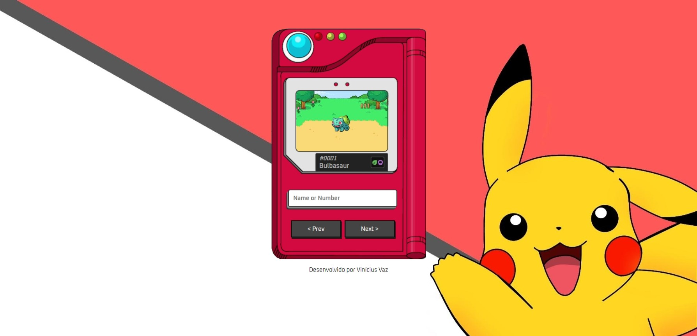

Pokedex V1
==========

### This is a Pokedex similar to the original anime design

**Made it in Vanilla JavaScript, HTML and CSS and it was based of \*\*Manual do Dev** original project  

### **New Features:**

*   Show the previous and next Pokemon fron the Pokedex
*   Search the desired Pokemon by it's index number or by original full-name
*   The numbers were formated to show it's decimals
*   The cries (sounds) of the Pokemons plays as you navigate through the Pokedex lista in the same way that it does in the games
*   Pokedex list is now amplified to the last Pokemon's generation. A total of 1025 can be searched and listed

#### My next step is to make a new version os this project with a totally diffent layout, new features such as showing the weakness, strengh, resistances between types, movements list besides weight and size average, etc.

#### Please feel free to ask and sugest any information tips to better implement this code and new features as well

#### Deploy: [https://viniciusagvaz.github.io/pokedex/](https://viniciusagvaz.github.io/pokedex/)

  

* * *

  

This project was made using the PokeApi

[https://pokeapi.co/](https://pokeapi.co/) 
